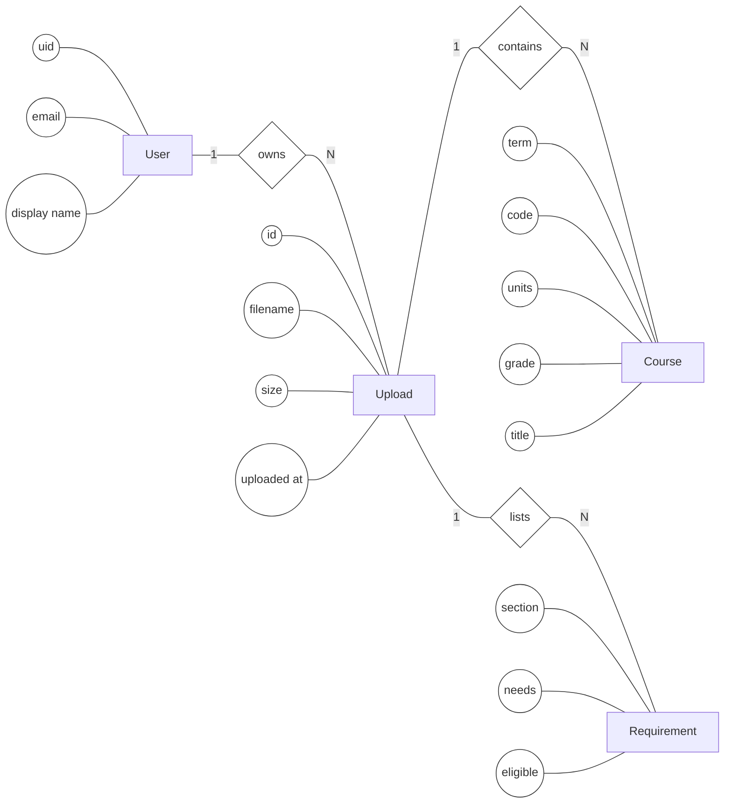
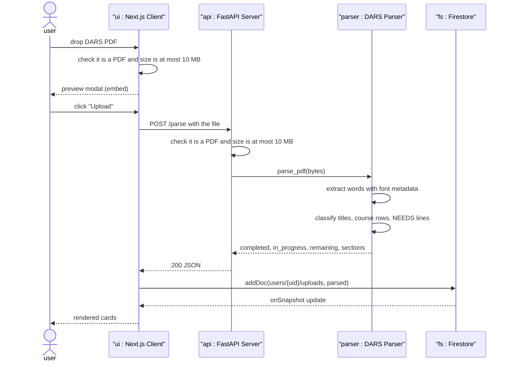

# DARS Tracker

This is a web app for UCLA students. You upload your DARS PDF (the Degree Audit Report) and it shows you what classes you've already finished, what you're taking right now, and what's still left to do. For each requirement you haven't met yet, it also lists the specific courses that would satisfy it.

The PDF itself doesn't get saved anywhere. We pull the structured data out of it (course rows, requirement summaries) and store that against your account. The file gets dropped after parsing.

---

## What it does

You sign in with Google or with an email and password through Firebase. From there you drag a PDF onto the page, look at the preview, and hit upload if it's the right one. The parser uses font metadata from the PDF to organize section headings versus course rows. After it runs, you get a dashboard split into completed, in-progress, outstanding requirements, along with a progress view that shows which graduation sections are fulfilled. Your past uploads are in Firestore and you can delete them whenever. Files have to be PDFs and 10 MB or smaller. We check that on both the client and the server, since you can't trust client checks on their own.

---

## Stack

| Layer    | Tech                                                |
| -------- | --------------------------------------------------- |
| Frontend | Next.js 16 (App Router), React 19, TypeScript       |
| Backend  | FastAPI, Uvicorn, `pdfplumber`                      |
| Auth     | Firebase Authentication (Google + Email/Password)   |
| Storage  | Cloud Firestore (per-user `uploads` subcollection)  |

---

## Architecture

There are two diagrams here. The first one shows the data side of things, and the second walks through what actually happens when you upload a file.

### Data model

Each signed-in user owns many uploads. Every upload holds the parsed course rows and the outstanding requirements pulled from that PDF. Rectangles are entities, ovals are attributes, and diamonds are relationships. The numbers on the edges are just how many of one thing connect to the other. This is known as the Entity-Relationship Diagram since it shows relationships between all entities in our data.



### What happens when you upload

This is what happens from when you drop a PDF on the page to when the cards show up on the screen. Solid arrows are calls, dashed ones are responses coming back. This is known as the Sequence Diagram as it models the app behavior.



---

## Running it locally

Need two terminals open (one for each server) and a Firebase project.

Make sure you have Node.js 20+ with npm, and Python 3.10+. Then go set up a Firebase project with Authentication and enable both Google and Email/Password providers. Also need Cloud Firestore in Native mode. In Firebase, copy the config values it gives you into `frontend/.env.local`:

```bash
NEXT_PUBLIC_FIREBASE_API_KEY=...
NEXT_PUBLIC_FIREBASE_AUTH_DOMAIN=your-project.firebaseapp.com
NEXT_PUBLIC_FIREBASE_PROJECT_ID=your-project
NEXT_PUBLIC_FIREBASE_APP_ID=1:...:web:...
```

Example Firestore rules:

```
rules_version = '2';
service cloud.firestore {
  match /databases/{database}/documents {
    match /users/{uid}/{document=**} {
      allow read, write: if request.auth != null && request.auth.uid == uid;
    }
  }
}
```

Then configure the backend:

```bash
cd backend
python3 -m venv venv
source venv/bin/activate
pip install -r requirements.txt
uvicorn main:app --reload --port 8000
```

Will run on `http://localhost:8000` and only takes requests from the Next.js app at `http://localhost:3000` (or `3001` if 3000 is busy).

And finally frontend:

```bash
cd frontend
npm install
npm run dev
```

Then open `http://localhost:3000`.
