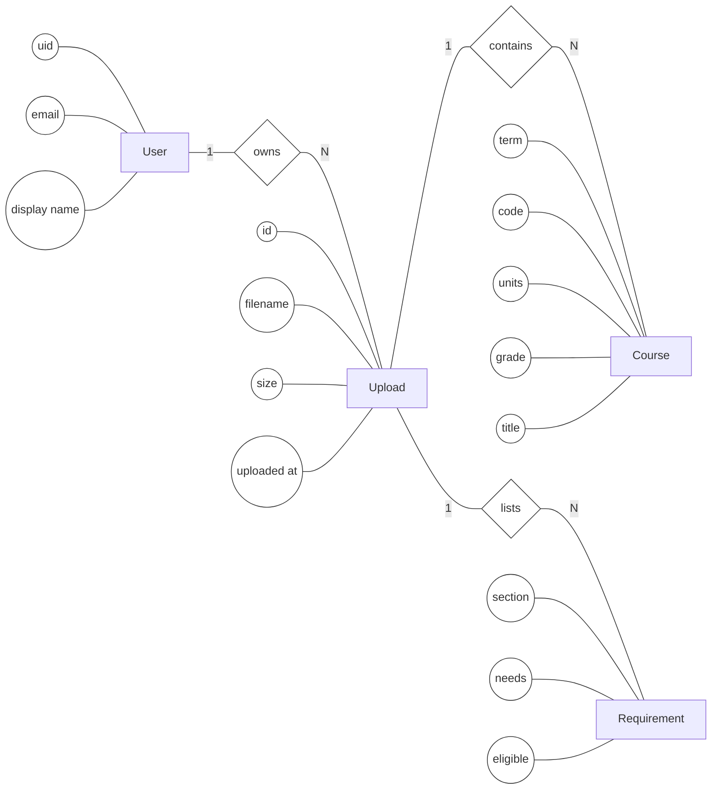
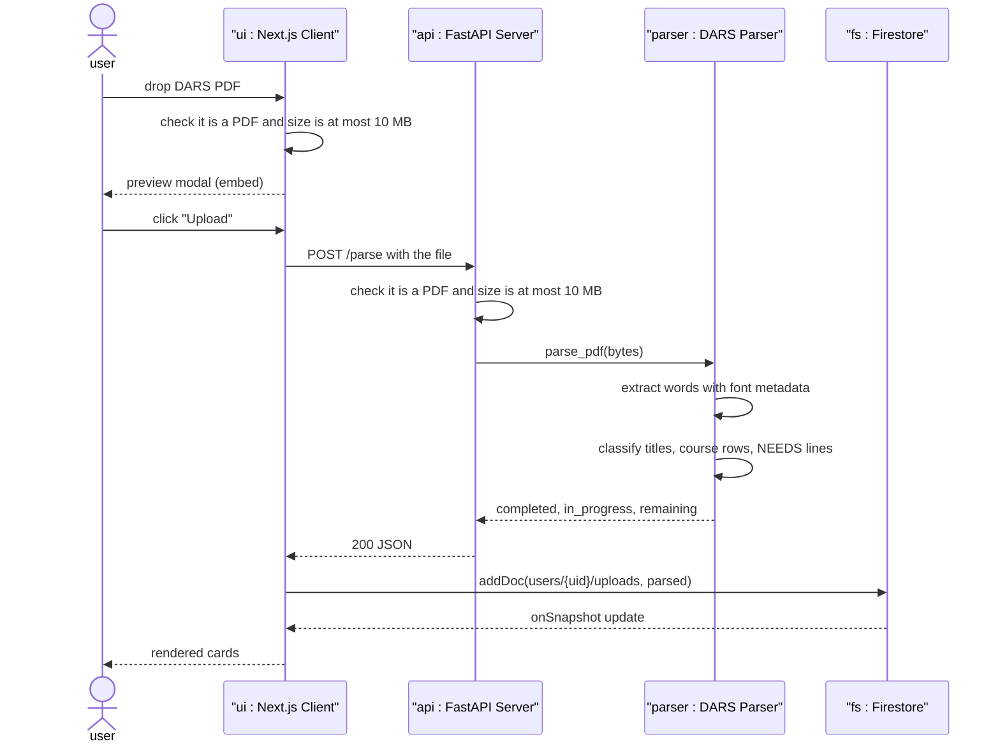

# DARS Tracker

A web app for UCLA students to upload their **Degree Audit Report (DARS)** PDF and see which courses they've completed, which they're currently taking, and which requirements are still outstanding along with the specific courses that can satisfy each remaining requirement.

The PDF is processed in the backend and is not stored. Only the extracted structured data such as course rows and requirement summaries is saved and linked to the respective account.

---

## Features

- **Google + email/password sign-in** via Firebase Auth.
- **Drag-and-drop upload** with an in-browser PDF preview before you commit.
- **Font-aware DARS parser** that uses font metadata to find section headings.
- **Live dashboard** with cards for completed, in-progress, and outstanding requirements.
- **Upload history** in Firestore that updates live and supports delete.
- **Client-side and server-side validation** for PDF only and size up to 10 MB.

---

## Stack

| Layer    | Tech                                                |
| -------- | --------------------------------------------------- |
| Frontend | Next.js 16 (App Router), React 19, TypeScript       |
| Backend  | FastAPI, Uvicorn, `pdfplumber`                      |
| Auth     | Firebase Authentication (Google + Email/Password)   |
| Storage  | Cloud Firestore (per-user `uploads` subcollection)  |

---

## Architecture

The architecture is modeled with two diagrams: an Entity-Relationship Diagram for the data view, and a Sequence Diagram for the behavioral view.

### Entity-Relationship Diagram (data view)

The Firestore data model. Each signed-in `User` owns many `Upload` documents, and each upload contains the parsed `Course` rows and outstanding `Requirement` rows extracted from that DARS PDF. Rectangles are entities, ovals are attributes, diamonds are relationships, and labels on the edges show cardinality.



A `Course` row whose `grade` is `IP` is currently in progress; any other grade means completed. A `Requirement` is one outstanding `NEEDS:` line from the audit, with `eligible` listing the courses that can satisfy it.

### Sequence Diagram (behavioral view)

What happens from the moment the user drops a PDF until parsed cards appear on screen. Solid arrows are synchronous calls, dashed arrows are responses.



---

## Folder layout

```
.
├── backend/
│   ├── main.py            FastAPI app, POST /parse endpoint, size limit
│   ├── parser.py          DARS PDF parser (pdfplumber + regex)
│   └── requirements.txt
└── frontend/
    ├── app/
    │   ├── layout.tsx     Root layout, wraps app in AuthProvider
    │   ├── page.tsx       Authenticated dashboard: upload + history + parsed cards
    │   ├── login/
    │   │   └── page.tsx   Google + email/password sign-in
    │   └── globals.css
    ├── lib/
    │   ├── firebase.ts    Firebase initialization (Auth + Firestore)
    │   └── auth.tsx       AuthProvider + useAuth() hook
    ├── next.config.ts
    └── package.json
```

---

## Running it locally

Need two terminals (one for each server) and a Firebase project.

### Prerequisites

- **Node.js 20+** and npm
- **Python 3.10+**
- A **Firebase project** with:
  - **Authentication** enabled (turn on the Google and Email/Password providers in the Firebase Console)
  - **Cloud Firestore** in Native mode

### 1. Firebase config (one-time)

In the Firebase Console, open your project → *Project settings* → *Your apps* → register a Web app. Copy the config values into a new file `frontend/.env.local`:

```bash
NEXT_PUBLIC_FIREBASE_API_KEY=...
NEXT_PUBLIC_FIREBASE_AUTH_DOMAIN=your-project.firebaseapp.com
NEXT_PUBLIC_FIREBASE_PROJECT_ID=your-project
NEXT_PUBLIC_FIREBASE_APP_ID=1:...:web:...
```

For development, the Firestore security rules can be permissive to authenticated users:

```
rules_version = '2';
service cloud.firestore {
  match /databases/{database}/documents {
    match /users/{uid}/{document=**} {
      allow read, write: if request.auth != null && request.auth.uid == uid;
    }
  }
}
```

### 2. Backend

```bash
cd backend
python3 -m venv venv
source venv/bin/activate
pip install -r requirements.txt
uvicorn main:app --reload --port 8000
```

The server listens on `http://localhost:8000` and only accepts requests from the Next.js app at `http://localhost:3000`.

### 3. Frontend

```bash
cd frontend
npm install
npm run dev
```

Open `http://localhost:3000`. You'll be redirected to `/login` until you sign in.

---

## API

### `POST /parse`

Sends a DARS PDF to the server in a `file` field.

- Rejects files that are not PDFs with `400`.
- Rejects files over 10 MB with `413`.
- Returns:

```json
{
  "completed":   [{ "term": "FA23", "code": "COM SCI 35L", "units": 4.0, "grade": "A",  "title": "Software Construction" }],
  "in_progress": [{ "term": "WI26", "code": "COM SCI 111", "units": 4.0, "grade": "IP", "title": "Operating Systems Principles" }],
  "remaining":   [{ "section": "UPPER-DIVISION ELECTIVES", "needs_raw": "8.0 UNITS", "eligible": "COM SCI 130, 131, 132, ..." }]
}
```

The backend does not save the uploaded PDF or the parsed result. We use Firestore for storage and it is only written by the client after a successful parse.

---